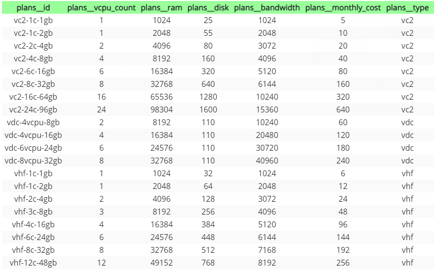

The Vultr API v2 is a set of HTTP endpoints that adhere to RESTful design principles and CRUD actions with predictable URIs. It uses standard HTTP response codes, authentication, and verbs. The API has consistent and well-formed JSON requests and responses with cursor-based pagination to simplify list handling. Error messages are descriptive and easy to understand. All functions of the Vultr customer portal are accessible via the API, enabling you to script complex unattended scenarios with any tool fluent in HTTP.

### API Key

The Vultr API v2 uses API keys for authentication. You can manage your API keys in the Vultr customer portal. Please do not share API keys publicly, or embed them in client-side code. It is a good security practice to restrict their use by IP address in the customer portal.

To authenticate a request, send your API Key as a bearer token in the request header.

Authentication Example

```
curl -H 'Authorization: Bearer {api-key}' https://api.vultr.com/v2/account
```

### List Regions

List all Regions at Vultr.

Example Request:

```
curl --location --request GET 'https://api.vultr.com/v2/regions'
```

Example Response:

```

{
   "regions":[
      {
         "id":"ams",
         "city":"Amsterdam",
         "country":"NL",
         "continent":"Europe",
         "options":[
            "ddos_protection"
         ]
      },
      {
         "id":"atl",
         "city":"Atlanta",
         "country":"US",
         "continent":"North America",
         "options":\[
            
         \]
      },
}

```

#### List of All Regions


<figure class="figure text-center col-xs-12 col-sm-12 col-lg-12">
  
<figcaption class="figure-caption text-center fw-normal text-dark">List all Regions.</figcaption>
</figure>

### Plans

A Plan is a particular configuration of vCPU, RAM, SSD, and bandwidth to deploy an Instance. Not all Plans are available in all Regions. You can browse plans in the Customer Portal or get a list of Plans from the API.

#### List Plans

Get a list of all VPS plans at Vultr. The list can be filtered by type.

Example Request:

```
curl --location --request GET 'https://api.vultr.com/v2/plans'
```

Example Response:

```
{
   "plans":[
      {
         "id":"vc2-1c-1gb",
         "vcpu_count":1,
         "ram":1024,
         "disk":25,
         "bandwidth":1024,
         "monthly_cost":5,
         "type":"vc2",
         "locations":["ewr","ord","dfw","sea","lax","atl","ams","lhr","fra","sjc","syd","yto","cdg","nrt","mia","sgp"]
      },
      {
         "id":"vc2-1c-2gb",
         "vcpu_count":1,
         "ram":2048,
         "disk":55,
         "bandwidth":2048,
         "monthly_cost":10,
         "type":"vc2",
         "locations":["ewr","ord","dfw","sea","lax","atl","ams","lhr","fra","sjc","syd","yto","cdg","nrt","mia","sgp"]
      },
}
```

#### List of all plans

<figure class="figure text-center col-xs-12 col-sm-12 col-lg-12">
  
<figcaption class="figure-caption text-center fw-normal text-dark">List of all Plans.</figcaption>
</figure>


### Operating System

#### List OS

We have a wide range of operating systems available to deploy server instances. You can also upload an ISO or choose from our public ISO library.

List the OS images available for installation at Vultr.

Example Request:

```
curl --location --request GET 'https://api.vultr.com/v2/os'
```

Example Response:

```
{
   "os":[
      {
         "id":124,
         "name":"Windows 2012 R2 x64",
         "arch":"x64",
         "family":"windows"
      },
      {
         "id":159,
         "name":"Custom",
         "arch":"x64",
         "family":"iso"
      },
       ],
   "meta":{
      "total":25,
      "links":{
         "next":"",
         "prev":""
      }
   }
}
```

#### List of All Operation System

<figure class="figure text-center col-xs-12 col-sm-12 col-lg-12">
 
<figcaption class="figure-caption text-center fw-normal text-dark">List of All Operating Systems.</figcaption>
</figure>

### Application

One-Click Applications are ready-to-run with minimal configuration. We have an extensive documentation library for our One-Click Apps.

Get a list of all One-Click Applications.

Example Request:

```
curl --location --request GET 'https://api.vultr.com/v2/applications'
```

Example Response:
```
{
  "applications": [
    {
      "id": 1,
      "name": "LEMP",
      "short_name": "lemp",
      "deploy_name": "LEMP on CentOS 6 x64"
    }
  ],
  "meta": {
    "total": 1,
    "links": {
      "next": "",
      "prev": ""
    }
  }
}
```

### Full List of Apps

<figure class="figure text-center col-xs-12 col-sm-12 col-lg-12">

<figcaption class="figure-caption text-center fw-normal text-dark">List of all Applications.</figcaption>
</figure>


Once you determine all id's parameter needed, you can now start create new server.

### Create Instance

Create a new VPS Instance in a <code>region</code> with the desired <code>plan</code>. Choose one of the following to deploy the instance:

<ul>
<li>os_id</li>
<li>iso_id</li>
<li>snapshot_id</li>
<li>app_id</li>
</ul>

Supply other attributes as desired.

Example Request:

```
curl --location --request POST 'https://api.vultr.com/v2/instances' \
--header 'Authorization: Bearer {api-key}' \
--header 'Content-Type: application/json' \
--data-raw '{
	"region" : "ewr", 
	"plan" : "vc2-6c-16gb", 
	"label" : "my label",
	"os_id" : 362,
	"user_data" : "dGVzdA==",
	"backups": "enabled"
}'
```

REQUEST BODY SCHEMA: application/json

Include a JSON object in the request body with a content type of application/json.

<table class="table">
<tr>
<th>Parameter</th>
<th>Type</th>
<th>Description</th>
</tr>
<tr>
<td>region (required)</td>
<td>string</td>
<td>The Region id where the Instance is located.</td>
</tr>
<tr>
<td>plan (required)</td>
<td>string</td>
<td>The Plan id to use when deploying this instance.</td>
</tr>
<tr>
<td>os_id</td>
<td>integer</td>
<td>The Operating System id to use when deploying this instance.</td>
</tr>
<tr>
<td>ipxe_chain_url</td>
<td>string</td>
<td>The URL location of the iPXE chainloader.</td>
</tr>
<tr>
<td>iso_id</td>
<td>string</td>
<td>The ISO id to use when deploying this instance.</td>
</tr>
<tr>
<td>script_id</td>
<td>integer</td>
<td>The Startup Script id to use when deploying this instance.</td>
</tr>
<tr>
<td>snapshot_id</td>
<td>string</td>
<td>The Snapshot id to use when deploying the instance.</td>
</tr>
<tr>
<td>enable_ipv6</td>
<td>boolean</td>
<td>Enable IPv6.
true
false</td>
</tr>
<tr>
<td>attach_private_network</td>
<td>Array of Strings</td>
<td>An array of Private Network ids to attach to this Instance. This parameter takes precedence over enable_private_network. Please choose one parameter.</td>
</tr>
<tr>
<td>label</td>
<td>string</td>
<td>A user-supplied label for this instance.</td>
</tr>
<tr>
<td>sshkey_id</td>
<td>string</td>
<td>The SSH Key id to install on this instance.</td>
</tr>
<tr>
<td>backups</td>
<td>string</td>
<td>Enable automatic backups for the instance.
enabled
disabled</td>
</tr>
<tr>
<td>app_id</td>
<td>integer</td>
<td>The Application id to use when deploying this instance.</td>
</tr>
<tr>
<td>user_data</td>
<td>string</td>
<td>The user-supplied, base64 encoded user data to attach to this instance.</td>
</tr>
<tr>
<td>ddos_protection</td>
<td>boolean</td>
<td>Enable DDoS protection (there is an additional charge for this).
true
false</td>
</tr>
<tr>
<td>activation_email</td>
<td>boolean</td>
<td>Notify by email after deployment.
true
false</td>
</tr>
<tr>
<td>hostname</td>
<td>string</td>
<td>The hostname to use when deploying this instance.</td>
</tr>
<tr>
<td>tag</td>
<td>string</td>
<td>The user-supplied tag.</td>
</tr>
<tr>
<td>firewall_group_id</td>
<td>string</td>
<td>The Firewall Group id to attach to this Instance.</td>
</tr>
<tr>
<td>reserved_ipv4</td>
<td>string</td>
<td>ID of the floating IP to use as the main IP of this server.</td>
</tr>
<tr>
<td>enable_private_network</td>
<td>boolean</td>
<td>If true, private networking support will be added to the new server.
This parameter attaches a single network. When no network exists in the region, it will be automatically created.
If there are multiple private networks in the instance's region, use attach_private_network instead to specify a network.</td>
</tr>
</table>