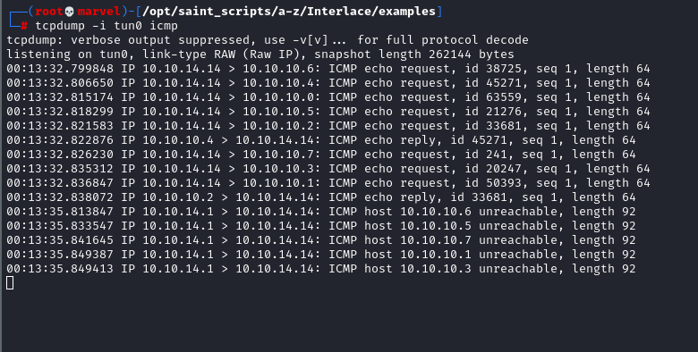

# Introduction 

## Instalation

<h5 class="step"> Step one, we clone the package from Github</h5>
```
sudo git clone https://github.com/codingo/Interlace.git /opt/Interlace
```

<h5 class="step"> Step two, enter the directory and setup virtual environment</h5> 

This step is optional but if you do not follow then you will install all the python packages globally which may or may not be a good thing depending on setup. 

We use the `cd` command to change the directory and the `virtualenv` command 
```
cd /opt/Interlace
virtualenv venv
source venv/bin/activate
```

<h5 class="step"> Step three, we install the program</h5>

First the Pip packages
```
pip3 install -r requirements.txt
```

Then install via the setup.py
``` 
sudo python3.9 setup.py install
```

> This took a few minutes for me so maybe now is the time for that coffee.

If you install interlace in a virtual environment then you will need to activate that environment before you use it
```
source /opt/Interlace/venv/bin/activate
interlace -h
```

## Scanning 

In the following examples, we will be looking at scans against one IP and multiple IP lists to compare. 

I have completed a discovery scan and I have the following IP addresses 
```
cat nmap-discovery.gnmap | grep 'Status: Up' | cut -d " " -f 2 | tee targets.txt
10.10.10.4
10.10.10.43
10.10.10.63
10.10.10.68
10.10.10.134
10.10.10.229
10.10.10.239
10.10.10.245
```

I will put them in a file called `targets.txt` while we look at the syntax. Interlace allows us to run commands with things like thread taken care of. It allows variable substitution to keep scans looking uniform and handles some advanced functionality we would have to code ourselves. 

### Blockers vs Blocks

There are several key concepts you need to understand in order to benefit from the Interlace tool. 

**Blockers** 

A blocker prevents execution of commands following until all commands proceeding it has been completed. We can declare a blocker as follows
```
_blocker_
```

**Blocks**

Blocks can be used to run commands that you would like to run in sequence, for example creating a folder before attempting to store the input in it. Interlace tries hard to run as much in parallel as possible and keep your system resources fully balanced however some things just need to be run in a strict order!

We can declare a block as follows
```
_block:something_
mkdir _output_
nmap _target_ -oA _output_/nmap-default
_block:something_
```

**Command Queue is Intelligent**

This is important! One of the key uses of Interlace is that you use it to run commands from a file. The commands are looped over for each of the targets and items you might want to provide as command-line flags or positional values are passed available to each command in the form of strings that are replaced on each iteration `_target_`, `_port_` and `_output_` for a few examples. See below for the full table. 

If however you put a line down that does not include any variables that need swapping out then Interlace will only run that command once. 

Without going into the technical aspects of running commands at the moment, if we ran the following two commands as part of a command file against a 10.10.10.0/29 Cidr range then we would only get one DNS packet sent to Google and eight sent to the 10.10.10.0/29
```
ping -c 1 8.8.8.8
ping -c 1 _target_
```

<figure class="figure text-center col-xs-12 col-sm-12 col-lg-12">
    
    <figcaption class="figure-caption text-center fw-normal text-dark">  </figcaption>
<figure class="figure text-center col-xs-12 col-sm-12 col-lg-12"><figcaption class="figure-caption text-center fw-normal text-dark">  </figcaption></figure></figure>

<figure class="figure text-center col-xs-12 col-sm-12 col-lg-12">
     
    <figcaption class="figure-caption text-center fw-normal text-dark">  </figcaption>
</figure>

This is ideal as we wouldn't want to ping google DNS every time we ping a new host. 

## Running Commands

We have two main ways of running commands. Either from a file or directly from the command line. 

### From The Command Line

<figure class="figure text-center col-xs-12 col-sm-12 col-lg-12">
    
    <figcaption class="figure-caption text-center fw-normal text-dark">Running Commands Direct From Terminal.</figcaption>
</figure>

Just to reinforce last point! When I do not use a replaceable target string the command runs just once.
<figure class="figure text-center col-xs-12 col-sm-12 col-lg-12">
    
    <figcaption class="figure-caption text-center fw-normal text-dark">Command Runs Once Without Replaceable String</figcaption>
</figure>

Lastly, note if I give the command two ports but no `_target_` then it will run once for each port. 

<figure class="figure text-center col-xs-12 col-sm-12 col-lg-12">
    
    <figcaption class="figure-caption text-center fw-normal text-dark">Adding Extra Ports Increases Command Variations.</figcaption></figure>

### From a File

When we create our scans from files we have more control and access to a few more features. 

Let us have a quick look at some of the variable replacement we have access to. 

| Variable  | Replacement                                                             |
|-----------|-------------------------------------------------------------------------|
| \_target\_  | Replaced with the expanded target list that the current thread is running against  |
| \_cleantarget\_  | Replaced with target cleanded from http:// or https://  |
| \_host\_ | Works the same as \_target\_, and can be used interchangeably |
| \_output\_   | Replaced with the output folder variable from Interlace              |
| \_port\_     | Replaced with the expanded port variable from Interlace                       |
| \_realport\_ | Replaced with the real port variable from Interlace                  |
| \_proxy\_    | Replaced with the proxy list from Interlace |
| \_random\_   | Replaced with the randomly chosen file from Interlace | 

As we pass options to Interlace they become available to us in our scans. 

For example, if we start a scan off like this
```
interlace -t 10.10.10.0/24 -p 80 -o ./bug_bounty -cL commands.il
```

We would have access to `_target_`, `_port_` and `_output_` variables within our Interlace command files (`-cL` is for providing Interlace with a list of commands). We might make a file such as
```
_block:nikto_
mkdir -p _output_/_target_/nikto/
nikto -host _target_ -port _port_ -output _output_/nikto/nikto-_target_-_port_.htm
_block:nikto_
```

We put the commands in a block to ensure they run sequentially in their thread. We do not want Nikto trying to save to an output directory that does not exist. 

While Interlace can look impressive at first we can avoid some of the screen clutter by adding the following options `--no-bar` and `--silent`.
```
interlace -t 10.10.10.0/24 -p 80 -o ./bug_bounty -cL commands.il --no-bar --silent
```

Epanding our example even further!

Open up burpsuite and echo the default proxy address into a proxy.txt file.
```
burpsuite
echo http://127.0.0.1:8080 > proxy.txt
```

Add the proxy option to Nikto
```
_block:nikto_
mkdir -p _output_/_target_/nikto/
nikto -host _target_ -port _port_ -output _output_/nikto/nikto-_target_-_port_.htm -useproxy _proxy_
_block:nikto_
```

Now as we scan our scans are caught by burpsuite.

<figure class="figure text-center col-xs-12 col-sm-12 col-lg-12">
    
    <figcaption class="figure-caption text-center fw-normal text-dark">Targets Being Proxied Via Burp.</figcaption>
</figure>

> One item we have not looked at yet is the `-threads` option. By default it is set to 10 but you can set it to what you want based on the performance of your machine. 

## Making a CTF Fuzzer

<h5 class="step"> Step one, Helper Function</h5>

```
#!/bin/bash


Let us create a file as follows (There is a convention of calling interlace configurations as dot `il`)
```
nano test.il
```

Inside the `test.il` file we will write the following
```
mkdir output && echo "made"
ping -c 2 _target_
```

Now we will run this on the command line 
```
interlace -t 10.10.10.0/29 -cL test.il --no-bar -threads 15 --silent
```


mkdir _target_ && echo "Made Directory For _target"
_blocker_
_block:ping_
ping -c 2 _target_
_block:ping_
_block:curl


```
nano staged_nmap.il
```
Inside we will put the following
```
rm -rf _output_
mkdir -p _output_/_target_/scans/
mkdir -p _output_/_target_/scans/nmap
mkdir -p _output_/_target_/scans/nmblookup
mkdir -p _output_/_target_/scans/cme
mkdir -p _output_/_target_/loot/
mkdir -p _output_/_target_/downloads/
mkdir -p _output_/_target_/shells/
_blocker_
nmap -sSV -vv --script banner -A --top-ports=20 _target_ -oA _output_/_target_/scans/nmap/nmap-_target_-quick-scan
_blocker_
nmap -T4 -sSV -vv -p-  --max-retries=2 _target_ -oA _output_/_target_/scans/nmap/nmap-_target_-full-65k-syn
nmap -T4 -sUV -vv --top-ports=2000 --max-retries=1 _target_ -oA _output_/_target_/scans/nmap/nmap-_target_-top-2000-udp
_blocker_
nmblookup -A _target_ > _output_/_target_/scans/nmblookup/nmblookup-_target_.txt
crackmapexec smb _target_ > _output_/_target_/scans/crackmapexec/cme-_target_.txt
```

We can now run our first command like so. 
```
interlace -tL ./targets.txt -threads 10 -cL staged_nmap.il -o /pentest/output
```

<figure class="figure text-center col-xs-12 col-sm-12 col-lg-12">
    
    <figcaption class="figure-caption text-center fw-normal text-dark">  </figcaption>
</figure>

<figure class="figure text-center col-xs-12 col-sm-12 col-lg-12">
    
    <figcaption class="figure-caption text-center fw-normal text-dark">  </figcaption>
</figure>


Variable	Replacement
_target_	Replaced with the expanded target list that the current thread is running against
_cleantarget_	Replaced with target cleanded from http:// or https://
_host_	Works the same as _target_, and can be used interchangeably
_output_	Replaced with the output folder variable from Interlace
_port_	Replaced with the expanded port variable from Interlace
_realport_	Replaced with the real port variable from Interlace
_proxy_	Replaced with the proxy list from Interlace
_random_	Replaced with the randomly chosen file from Interlace