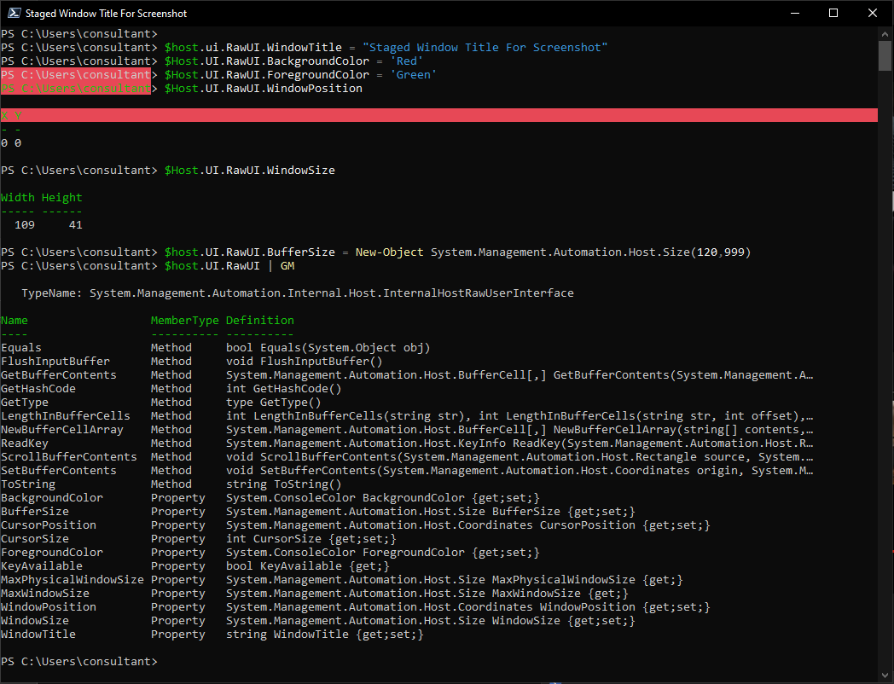

# Set PowerShell Terminal Options

We can set values within the terminal to customise how the terminal output is displayed, the title of the terminal window shown or how much buffer size to use. Using these values can be helpful for several things, such as distinguishing windows, staging the title for a report screenshot or improved recognition of terminal output. 



### Screen Buffer

Get the current screen buffer.

```
:::powershell
$host.UI.RawUI.BufferSize
```

Enlarge the terminal screen buffer to capture more output

```
:::powershell
$host.UI.RawUI.BufferSize = New-Object System.Management.Automation.Host.Size(120,999)
```

<aside>
💡 Note that when you attempt to decrease the width to below the current width, you will be presented with an error
</aside>

### Console Style (for quick identification).

Set Console Title

```
:::powershell
$host.ui.RawUI.WindowTitle = "Staged Window Title For Screenshot"
```

Set Console Colours

```
:::powershell
$Host.UI.RawUI.BackgroundColor = 'Black'
$Host.UI.RawUI.ForegroundColor = 'Green'
```

## Set Window Position

Find out what the current window position is

```
:::powershell
$host.UI.RawUI.WindowPosition
```

Set window position

```
:::powershell
$host.UI.RawUI.WindowPosition = New-Object System.Management.Automation.Host.Coordinates(0,160)
```